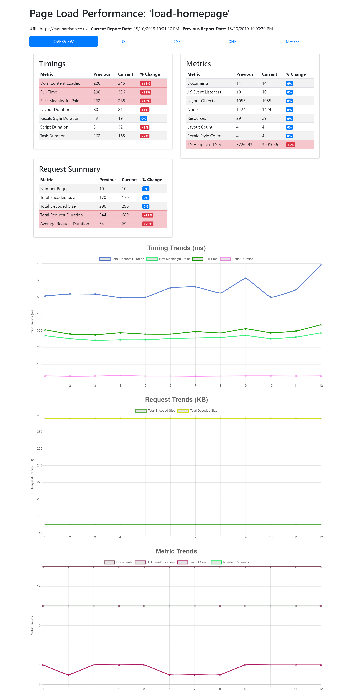

# Puppeteer Perf

Measure and monitor website performance with Headless Chrome and Puppeteer

## Key Features

- Run performance tests within Chrome itself just as your users will. No emaulation or estimations
- Measure key performance indicators for page load: DOM loaded, First Meaningful Paint, Full Page Loaded
- Monitor page metrics: number of DOM nodes, number of restyle calculations etc
- Track all requests made by type: how long your JS takes too load, how big is your bundle size, how many XHR requests are being made?
- Write performance tests as standard Jest test cases
- Automatic report creation to monitor key indicators over time
- Save results to flat file or Sqlite database for easy analytics

## Usage

1. Clone repo
2. `npm install`
3. See example `tests/load-homepage.test.js` for sample which measures page load
4. Run `npm run test` to being Jest test suite
5. See `generated/` directory for performance reports

```js
describe("Load Homepage", () => {
    let runData;
    beforeAll(async () => {
        const url = "https://ryanharrison.co.uk";
        runData = await measurePageLoad(browser, "load-homepage", url, 3);
    });

    test("full page load should be within 1 second", () => {
        expect(runData.timings.fullTime).toBeLessThan(1000);
    });

    it("should have less than 1500 nodes", () => {
        expect(runData.metrics.nodes).toBeLessThan(1500);
    });
});
```
## Reports

Each test run will also generate a report allowing you to track key indicators through time. See `sample/` directory for example report.




